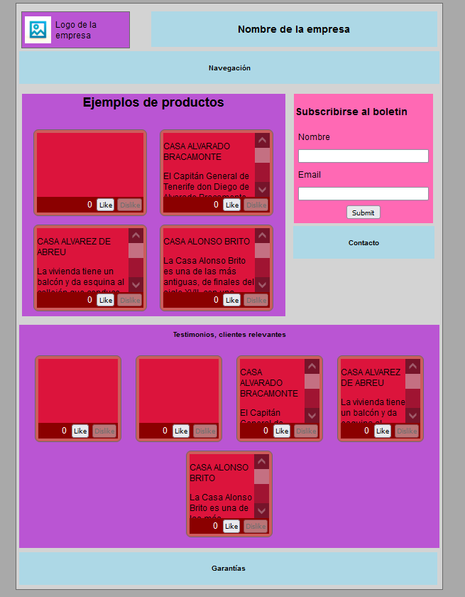

# Front-end for learning dockers: Project for the subject *Sistemas y Tecnologías Web: Cliente*

Marcos Barrios, alu0101056944

### Note on a problem: use 0.0.0.0 when doing express through a virtual machine because port forwarding connects through private ip and not through "localhost".

## Description

Using another frontend project from the *Sistemas y Tecnologías Web: Cliente* subject to learn docker for the subject *Administración de Infrastructuras TIC y Sistemas*.

